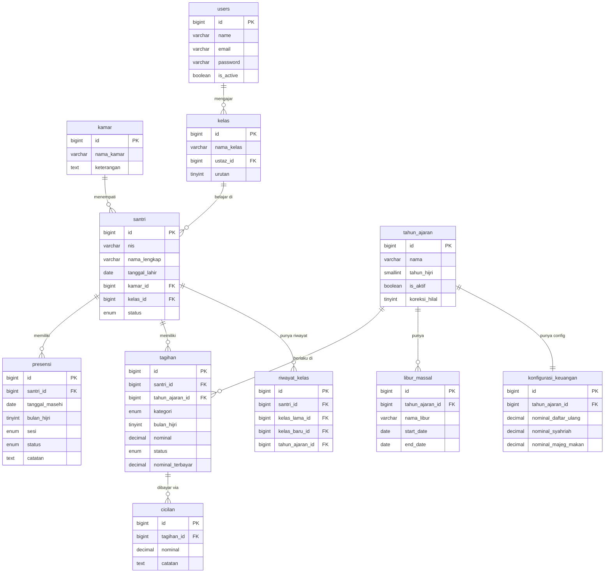

# PRODUCT REQUIREMENTS DOCUMENT (PRD) v3.1
## SIM-PONDOK — Sistem Informasi Manajemen Pondok Pesantren

> **Status**: ✅ SIAP IMPLEMENTASI
> **Versi**: 3.1 (Revisi dari v3.0 berdasarkan feedback stakeholder — 13 Juni 2026)
> **Tanggal**: 13 Juni 2026
> **Timezone**: WIB (UTC+7)

---

## DAFTAR ISI
1. [Tech Stack & Infrastruktur](#1-tech-stack--infrastruktur)
2. [Arsitektur Otorisasi & RBAC](#2-arsitektur-otorisasi--rbac)
3. [Data Model / ERD](#3-data-model--erd)
4. [Kalender Hijriah Engine](#4-kalender-hijriah-engine)
5. [Modul Master Data (Admin)](#5-modul-master-data-admin)
6. [Modul Akademik (Ustaz)](#6-modul-akademik-ustaz)
7. [Modul Keuangan (Bendahara)](#7-modul-keuangan-bendahara)
8. [Task Scheduling (Cron Jobs)](#8-task-scheduling-cron-jobs)
9. [Spesifikasi UI/UX](#9-spesifikasi-uiux)
10. [Spesifikasi Export XLSX](#10-spesifikasi-export-xlsx)
11. [Spesifikasi Keamanan](#11-spesifikasi-keamanan)
12. [PWA (Progressive Web App)](#12-pwa-progressive-web-app)
13. [Audit Trail](#13-audit-trail)

---

## 1. Tech Stack & Infrastruktur

### 1.1. Application Stack

| Layer | Teknologi | Versi | Keterangan |
|---|---|---|---|
| Backend Framework | Laravel | 12.x | PHP 8.3+ |
| Frontend Reaktif | Livewire | 3.x | Komponen real-time |
| Styling | Tailwind CSS | 3.x | Mobile-first utilities |
| Database | MySQL | 8.0+ | Relational, ACID-compliant |
| Cache & Queue | Redis | 7.x | Session, cache, queue driver |
| Hijri Calendar | `omarmokhtar/laravel-hijri-date` | Latest | Akurasi Umm Al-Qura, support L12 |
| RBAC | `spatie/laravel-permission` | 6.x | Role & Permission management |
| Excel Export | `maatwebsite/laravel-excel` | 3.x | Export .xlsx |
| Audit Trail | `owen-it/laravel-auditing` | 13.x | Before/After value logging |
| Queue Worker | Laravel Horizon | Latest | Monitoring queue Redis |

### 1.2. Spesifikasi Server (Produksi)

Untuk skala **100–150 santri**, server berikut adalah pilihan optimal:

| Komponen | Spesifikasi | Keterangan |
|---|---|---|
| OS | Ubuntu 24.04 LTS | LTS — support hingga 2029 |
| Web Server | Nginx (PHP-FPM) | Ringan, concurrent-ready |
| PHP | PHP 8.3 (FPM) | Performa terbaik untuk L12 |
| Database | MySQL 8.0 | Pada server yang sama |
| Cache/Queue | Redis 7.x | Untuk cache & queue worker |
| RAM | **2 GB** (minimum) | Sangat cukup untuk 150 user |
| CPU | 1–2 vCPU | 1 vCPU sudah lebih dari cukup |
| Storage | 25 GB SSD NVMe | Termasuk backup DB lokal |
| Process Manager | Supervisor | Menjaga queue worker tetap running |

**Rekomendasi Provider (Indonesia):**
- **Niagahoster Cloud VPS** atau **IDCloudHost** (harga ~Rp 100–150k/bulan)
- Alternatif internasional: **Hetzner VPS CAX11** (€4.51/bulan — terbaik harga/performa)

**SSL:** Gunakan **Let's Encrypt** (gratis) via Certbot.

**Deployment:** GitHub Actions → SSH deploy ke VPS (tanpa Forge untuk efisiensi biaya).

### 1.3. Struktur Direktori Laravel (Key Files)

```
app/
├── Console/Kernel.php          ← Task Scheduling
├── Http/
│   ├── Middleware/             ← Role middleware
│   └── Livewire/               ← Semua komponen Livewire
├── Models/                     ← Semua Eloquent models
├── Services/
│   ├── HijriCalendarService.php ← Wrapper kalender Hijriah
│   ├── KeuanganService.php      ← Logika bisnis keuangan
│   └── PresensiService.php      ← Logika bisnis presensi
routes/
├── web.php                     ← Routes per role
└── console.php                 ← Artisan commands
database/
├── migrations/                 ← Semua migration
└── seeders/                    ← Default data (kelas, tahun ajaran)
```

---

## 2. Arsitektur Otorisasi & RBAC

### 2.1. Roles & Permissions (Spatie Permission)

**Package:** `spatie/laravel-permission`

| Role | Akses Modul | Catatan |
|---|---|---|
| `admin` | Semua modul + konfigurasi | Full access |
| `ustaz` | Presensi kelas yang ditugaskan | Dibatasi oleh `kelas_id` |
| `bendahara` | Tagihan & Pembayaran | Akses semua santri |

**Definisi Permissions (granular):**
```php
// Master Data
'master.santri.view', 'master.santri.create', 'master.santri.edit', 'master.santri.delete'
'master.kelas.view', 'master.kelas.manage'
'master.kamar.view', 'master.kamar.manage'
'master.user.view', 'master.user.manage'

// Akademik
'akademik.presensi.view', 'akademik.presensi.input'

// Keuangan
'keuangan.tagihan.view', 'keuangan.tagihan.edit'

// Kalender & Konfigurasi
'config.kalender.manage', 'config.keuangan.manage'

// Laporan
'laporan.presensi.export', 'laporan.keuangan.export'
```

### 2.2. Login & Routing

- **Satu halaman login** (`/login`) untuk semua role.
- Setelah login, sistem redirect berdasarkan role:
  - `admin` → `/admin/dashboard`
  - `ustaz` → `/ustaz/dashboard`
  - `bendahara` → `/bendahara/dashboard`
- Middleware `role:admin`, `role:ustaz`, `role:bendahara` melindungi semua route group.

### 2.3. Session Management

| Role | Session Timeout | Keterangan |
|---|---|---|
| Admin | 120 menit idle | Data sensitif |
| Bendahara | 120 menit idle | Data keuangan sensitif |
| Ustaz | 480 menit idle | Dipakai aktif saat sesi (pagi/malam) |

---

## 3. Data Model / ERD

### 3.1. Daftar Tabel & Relasi

```
users (1) ──────────────── (*) kelas [ustaz_id]
kelas (1) ──────────────── (*) santri [kelas_id]
kamar (1) ──────────────── (*) santri [kamar_id]
tahun_ajaran (1) ────────── (*) tagihan [tahun_ajaran_id]
tahun_ajaran (1) ────────── (*) libur_massal [tahun_ajaran_id]
tahun_ajaran (1) ────────── (1) konfigurasi_keuangan [tahun_ajaran_id]
santri (1) ──────────────── (*) presensi [santri_id]
santri (1) ──────────────── (*) tagihan [santri_id]
santri (1) ──────────────── (*) riwayat_kelas [santri_id]
tagihan (1) ─────────────── (*) cicilan [tagihan_id]
```

### 3.2. Skema Tabel Lengkap

---

#### Tabel: `users`
```sql
id              BIGINT UNSIGNED PK AUTO_INCREMENT
name            VARCHAR(100) NOT NULL
email           VARCHAR(150) NOT NULL UNIQUE
password        VARCHAR(255) NOT NULL
is_active       BOOLEAN DEFAULT TRUE
remember_token  VARCHAR(100) NULLABLE
created_at      TIMESTAMP
updated_at      TIMESTAMP
```
> Role dikelola oleh Spatie Permission di tabel `model_has_roles`.

---

#### Tabel: `kamar`
```sql
id          BIGINT UNSIGNED PK AUTO_INCREMENT
nama_kamar  VARCHAR(50) NOT NULL  -- contoh: "Kamar A", "Al-Amin"
keterangan  TEXT NULLABLE
created_at  TIMESTAMP
updated_at  TIMESTAMP
```

---

#### Tabel: `kelas`
```sql
id         BIGINT UNSIGNED PK AUTO_INCREMENT
nama_kelas VARCHAR(50) NOT NULL  -- contoh: "Kelas 1", "Kelas Ula"
ustaz_id   BIGINT UNSIGNED FK → users(id) NULLABLE ON DELETE SET NULL
urutan     TINYINT UNSIGNED DEFAULT 1  -- untuk sorting tampilan
created_at TIMESTAMP
updated_at TIMESTAMP
```
> Default seed: 4 kelas (Kelas 1, 2, 3, 4). Ustaz bisa tidak ditugaskan (nullable).

---

#### Tabel: `santri`
```sql
id              BIGINT UNSIGNED PK AUTO_INCREMENT
nis             VARCHAR(20) UNIQUE NULLABLE       -- Nomor Induk Santri (opsional)
nama_lengkap    VARCHAR(100) NOT NULL
tempat_lahir    VARCHAR(100) NULLABLE
tanggal_lahir   DATE NULLABLE
alamat          TEXT NULLABLE
kamar_id        BIGINT UNSIGNED FK → kamar(id) NULLABLE ON DELETE SET NULL
kelas_id        BIGINT UNSIGNED FK → kelas(id) NULLABLE ON DELETE SET NULL
status          ENUM('aktif', 'nonaktif', 'lulus') DEFAULT 'aktif'
                -- aktif: muncul di presensi & generate tagihan
                -- nonaktif: tidak muncul di presensi, tagihan di-freeze per bulan
                -- lulus: read-only arsip alumni
tanggal_masuk   DATE NULLABLE
tanggal_keluar  DATE NULLABLE  -- diisi saat nonaktif atau lulus
catatan         TEXT NULLABLE
created_at      TIMESTAMP
updated_at      TIMESTAMP

INDEX: (status), (kelas_id), (kamar_id)
```

---

#### Tabel: `riwayat_kelas`
> Audit trail perpindahan kelas santri (untuk fitur Kenaikan Kelas Massal)
```sql
id              BIGINT UNSIGNED PK AUTO_INCREMENT
santri_id       BIGINT UNSIGNED FK → santri(id) ON DELETE CASCADE
kelas_lama_id   BIGINT UNSIGNED FK → kelas(id) ON DELETE SET NULL NULLABLE
kelas_baru_id   BIGINT UNSIGNED FK → kelas(id) ON DELETE SET NULL NULLABLE
tahun_ajaran_id BIGINT UNSIGNED FK → tahun_ajaran(id) ON DELETE CASCADE
dipindah_oleh   BIGINT UNSIGNED FK → users(id) ON DELETE SET NULL NULLABLE
created_at      TIMESTAMP

INDEX: (santri_id), (tahun_ajaran_id)
```

---

#### Tabel: `tahun_ajaran`
```sql
id              BIGINT UNSIGNED PK AUTO_INCREMENT
nama            VARCHAR(20) NOT NULL  -- contoh: "1446H", "1447H"
tahun_hijri     SMALLINT UNSIGNED NOT NULL  -- contoh: 1446
is_aktif        BOOLEAN DEFAULT FALSE  -- hanya 1 yang aktif setiap saat
koreksi_hilal   TINYINT DEFAULT 0  -- nilai offset hari (-3 s.d. +3)
created_at      TIMESTAMP
updated_at      TIMESTAMP

CONSTRAINT: Hanya 1 row yang is_aktif = TRUE (enforced di application layer)
```

---

#### Tabel: `libur_massal`
```sql
id              BIGINT UNSIGNED PK AUTO_INCREMENT
tahun_ajaran_id BIGINT UNSIGNED FK → tahun_ajaran(id) ON DELETE CASCADE
nama_libur      VARCHAR(100) NOT NULL  -- contoh: "Libur Akhir Tahun"
start_date      DATE NOT NULL  -- tanggal Masehi
end_date        DATE NOT NULL  -- tanggal Masehi
created_by      BIGINT UNSIGNED FK → users(id) ON DELETE SET NULL NULLABLE
created_at      TIMESTAMP
updated_at      TIMESTAMP
```

---

#### Tabel: `presensi`
```sql
id              BIGINT UNSIGNED PK AUTO_INCREMENT
santri_id       BIGINT UNSIGNED FK → santri(id) ON DELETE CASCADE
kelas_id        BIGINT UNSIGNED FK → kelas(id) ON DELETE SET NULL NULLABLE
tanggal_masehi  DATE NOT NULL
bulan_hijri     TINYINT UNSIGNED NOT NULL   -- 1-12
tahun_hijri     SMALLINT UNSIGNED NOT NULL
sesi            ENUM('pagi', 'malam') NOT NULL
status          ENUM('hadir', 'izin_sakit', 'alfa') NOT NULL DEFAULT 'alfa'
catatan         TEXT NULLABLE               -- catatan keterangan presensi (misal: sakit demam)
dicatat_oleh    BIGINT UNSIGNED FK → users(id) ON DELETE SET NULL NULLABLE
created_at      TIMESTAMP
updated_at      TIMESTAMP

UNIQUE KEY: (santri_id, tanggal_masehi, sesi)  -- 1 record per santri per sesi per hari
INDEX: (tanggal_masehi), (santri_id, bulan_hijri, tahun_hijri), (kelas_id)
```

> **Catatan**: Auto-Alfa dihapus dari sistem. Presensi yang belum diinput tidak otomatis berubah.
> Status default adalah `alfa` saat record dibuat oleh sistem (manual atau batch).

---

#### Tabel: `konfigurasi_keuangan`
> Diatur oleh Admin, dibaca oleh Bendahara sebagai referensi nominal.
```sql
id                      BIGINT UNSIGNED PK AUTO_INCREMENT
tahun_ajaran_id         BIGINT UNSIGNED FK → tahun_ajaran(id) ON DELETE CASCADE UNIQUE
nominal_daftar_ulang    DECIMAL(12,0) NOT NULL DEFAULT 0  -- 1x per tahun
nominal_syahriah_sem1   DECIMAL(12,0) NOT NULL DEFAULT 0  -- 1x per semester (dibayar sekaligus)
nominal_syahriah_sem2   DECIMAL(12,0) NOT NULL DEFAULT 0  -- 1x per semester (dibayar sekaligus)
nominal_majeg_makan     DECIMAL(12,0) NOT NULL DEFAULT 0  -- per bulan (10 bulan aktif)
catatan                 TEXT NULLABLE
created_at              TIMESTAMP
updated_at              TIMESTAMP
```

---

#### Tabel: `tagihan`
> Satu baris = satu item tagihan spesifik per santri per periode.
```sql
id              BIGINT UNSIGNED PK AUTO_INCREMENT
santri_id       BIGINT UNSIGNED FK → santri(id) ON DELETE CASCADE
tahun_ajaran_id BIGINT UNSIGNED FK → tahun_ajaran(id) ON DELETE CASCADE
kategori        ENUM(
                  'daftar_ulang',    -- 1x per tahun (tidak per bulan)
                  'syahriah_sem1',   -- 1x per tahun (dibayar sekaligus untuk Sem 1: Dzulqa'dah–Rabi'ul Akhir)
                  'syahriah_sem2',   -- 1x per tahun (dibayar sekaligus untuk Sem 2: Jumadil Awal–Ramadhan)
                  'majeg_makan'      -- per bulan: Dzulqa'dah s.d. Ramadhan (11 bulan aktif)
                ) NOT NULL
bulan_hijri     TINYINT UNSIGNED NULLABLE
                -- NULL untuk daftar_ulang, syahriah_sem1, syahriah_sem2
                -- DIISI untuk majeg_makan (1 baris per bulan)
tahun_hijri     SMALLINT UNSIGNED NULLABLE
nominal         DECIMAL(12,0) NOT NULL DEFAULT 0
status          ENUM('belum_bayar', 'dicicil', 'lunas', 'pulang') NOT NULL DEFAULT 'belum_bayar'
                -- pulang: santri nonaktif di periode ini, tidak wajib bayar
nominal_terbayar DECIMAL(12,0) NOT NULL DEFAULT 0
sisa_tagihan    DECIMAL(12,0) GENERATED ALWAYS AS (nominal - nominal_terbayar) STORED
catatan         TEXT NULLABLE
created_at      TIMESTAMP
updated_at      TIMESTAMP

UNIQUE KEY: (santri_id, tahun_ajaran_id, kategori, bulan_hijri)
INDEX: (santri_id, tahun_ajaran_id), (status), (kategori)
```

---

#### Tabel: `cicilan`
> Log setiap kali ada pembayaran parsial/pelunasan.
```sql
id          BIGINT UNSIGNED PK AUTO_INCREMENT
tagihan_id  BIGINT UNSIGNED FK → tagihan(id) ON DELETE CASCADE
nominal     DECIMAL(12,0) NOT NULL
catatan     TEXT NULLABLE    -- contoh: "Santri Pindahan", "Via Transfer BCA"
dicatat_oleh BIGINT UNSIGNED FK → users(id) ON DELETE SET NULL NULLABLE
created_at  TIMESTAMP

INDEX: (tagihan_id)
```

---

#### Tabel: `activity_log` (Audit Trail)
> Dikelola oleh package `owen-it/laravel-auditing`. Tabel ini auto-generated.
```sql
id            BIGINT UNSIGNED PK AUTO_INCREMENT
user_id       BIGINT UNSIGNED NULLABLE FK → users(id)
user_type     VARCHAR(255) NULLABLE
event         VARCHAR(255)              -- created, updated, deleted
auditable_type VARCHAR(255)            -- App\Models\Santri, dll.
auditable_id  BIGINT UNSIGNED
old_values    JSON NULLABLE             -- nilai sebelum perubahan
new_values    JSON NULLABLE             -- nilai setelah perubahan
url           TEXT NULLABLE
ip_address    VARCHAR(45) NULLABLE
user_agent    TEXT NULLABLE
tags          TEXT NULLABLE
created_at    TIMESTAMP
updated_at    TIMESTAMP

INDEX: (auditable_type, auditable_id), (user_id)
```

> Model yang diaudit: `Santri`, `Tagihan`, `Presensi`, `TahunAjaran`, `Kelas`, `Kamar`

---

### 3.3. ERD Visual (Mermaid)



---

## 4. Kalender Hijriah Engine

### 4.1. Library

**Package:** `omarmokhtar/laravel-hijri-date`

- **Basis kalender**: Umm Al-Qura Calendar (standar Arab Saudi, paling akurat)
- **Support**: Laravel 10, 11, 12
- **Fitur**: Built-in caching untuk performa konversi
- **Fallback**: Jika API Aladhan timeout, gunakan cache lokal

### 4.2. HijriCalendarService

```php
// app/Services/HijriCalendarService.php
class HijriCalendarService {
    // Konversi tanggal hari ini ke Hijriah
    public function today(): array   // returns ['day', 'month', 'year', 'month_name']

    // Cek apakah tanggal tertentu adalah hari presensi valid
    public function isValidAttendanceDay(Carbon $date, string $sesi): bool

    // Cek apakah hari ini di dalam range libur massal
    public function isHoliday(Carbon $date): bool

    // Dapatkan offset kalender (koreksi_hilal dari tahun_ajaran aktif)
    public function getHijriOffset(): int

    // Konversi dengan mempertimbangkan koreksi_hilal
    public function convertToHijri(Carbon $date): array
}
```

### 4.3. Definisi Bulan Aktif vs Libur

| No | Bulan Hijriah | Status | Keterangan |
|---|---|---|---|
| 1 | Dzulqa'dah | ✅ Aktif | Awal tahun ajaran |
| 2 | Dzulhijjah | ✅ Aktif | Majeg Makan mulai |
| 3 | Muharram | ✅ Aktif | |
| 4 | Safar | ✅ Aktif | |
| 5 | Rabi'ul Awwal | ✅ Aktif | |
| 6 | Rabi'ul Akhir | ✅ Aktif | Akhir Sem 1 |
| 7 | Jumadil Awal | ✅ Aktif | Awal Sem 2 |
| 8 | Jumadil Akhir | ✅ Aktif | |
| 9 | Rajab | ✅ Aktif | |
| 10 | Sya'ban | ✅ Aktif | |
| 11 | Ramadhan | ✅ Aktif | Akhir tahun ajaran |
| 12 | **Syawal** | 🚫 Libur Global | Tidak ada presensi & tagihan |

### 4.4. Pembagian Semester

| Semester | Bulan Hijriah | Jumlah Bulan |
|---|---|---|
| **Sem 1** | Dzulqa'dah, Dzulhijjah, Muharram, Safar, Rabi'ul Awwal, Rabi'ul Akhir | **6 bulan** |
| **Sem 2** | Jumadil Awal, Jumadil Akhir, Rajab, Sya'ban, Ramadhan | **5 bulan** |
| **Libur** | Syawal | 1 bulan |

### 4.5. Pengecualian Presensi (Auto-Lock)

| Kondisi | Sesi | Status Form |
|---|---|---|
| Hari Kamis | Malam (18:00-22:00) | 🔒 Terkunci otomatis |
| Hari Jum'at | Pagi (05:00-08:00) | 🔒 Terkunci otomatis |
| Range libur massal (manual admin) | Semua sesi | 🔒 Terkunci otomatis |
| Bulan Syawal | Semua sesi | 🔒 Terkunci otomatis |

### 4.6. Koreksi Hilal

- **Field**: `tahun_ajaran.koreksi_hilal` (TINYINT, range -3 s.d. +3)
- **Scope**: **Prospektif saja** — hanya mempengaruhi tampilan/trigger dari tanggal perubahan ke depan. Tidak mengubah data presensi historis yang sudah tersimpan.
- **Mekanisme**: `HijriCalendarService::convertToHijri()` selalu menambahkan nilai `koreksi_hilal` ke hasil konversi mentah library.
- **Tampilan**: Dashboard menampilkan tanggal Hijriah dengan offset, bukan tanggal raw library.

---

## 5. Modul Master Data (Admin)

### 5.1. Manajemen Santri

**Form Input Santri:**
| Field | Tipe | Wajib | Keterangan |
|---|---|---|---|
| Nama Lengkap | VARCHAR(100) | ✅ | |
| NIS | VARCHAR(20) | ❌ | Opsional |
| Tempat Lahir | VARCHAR(100) | ❌ | |
| Tanggal Lahir | DATE | ❌ | |
| Alamat | TEXT | ❌ | |
| Kamar | FK → kamar | ❌ | Dropdown |
| Kelas | FK → kelas | ❌ | Dropdown |
| Status | ENUM | ✅ | Default: aktif |
| Tanggal Masuk | DATE | ❌ | |

**State Machine Santri:**

```
[aktif] ──(nonaktifkan)──→ [nonaktif] ──(aktifkan kembali)──→ [aktif]
[aktif] ──(luluskan)──────→ [lulus]    (final, read-only)
[nonaktif] ──(luluskan)──→ [lulus]
```

**Efek Perubahan Status:**

| Perubahan | Efek di Presensi | Efek di Tagihan | Siapa Bisa |
|---|---|---|---|
| Aktif → Nonaktif | Tidak muncul di form presensi bulan berjalan dan seterusnya. Data historis tetap ada. | Tagihan bulan **berjalan dan seterusnya** di-set status `pulang`. Tagihan bulan sebelumnya tetap. | Admin |
| Nonaktif → Aktif | Muncul kembali di presensi mulai bulan berikutnya. | Tagihan bulan aktif kembali di-generate. | Admin (saja) |
| Apapun → Lulus | Mode read-only. Tidak muncul di presensi. | Semua tagihan tersisa di-freeze (tidak dihapus). | Admin |

### 5.2. Manajemen Kelas

- **Default Seed**: 4 kelas (Kelas 1, Kelas 2, Kelas 3, Kelas 4)
- **Field**: nama_kelas, ustaz_id (penugasan ustaz), urutan
- Admin bisa menambah/edit/hapus kelas
- Kelas yang dihapus: ustaz_id & kelas_id di santri menjadi NULL

### 5.3. Manajemen Kamar

- **Field**: nama_kamar, keterangan
- Digunakan sebagai filter di dashboard Bendahara
- Tidak ada batasan jumlah kamar

### 5.4. Kenaikan Kelas Massal

**Alur:**
1. Admin membuka halaman "Kenaikan Kelas Massal"
2. Sistem menampilkan tabel santri aktif dengan filter kelas asal
3. Admin memilih santri (checkbox) dan memilih kelas tujuan dari dropdown
4. Admin menekan tombol "Proses Kenaikan"
5. Sistem menampilkan **preview modal**: "X santri akan dipindahkan ke Kelas Y. Lanjutkan?"
6. Setelah konfirmasi:
   - `santri.kelas_id` diupdate ke kelas baru
   - Record baru dibuat di `riwayat_kelas` untuk setiap santri
7. Activity log tercatat

### 5.5. Konfigurasi Keuangan (di panel Admin)

Admin dapat mengatur nominal untuk tahun ajaran aktif:
- **Nominal Daftar Ulang** — 1x per tahun per santri
- **Nominal Syahriah Semester 1** — dibayar sekaligus (mencakup 6 bulan: Dzulqa'dah s.d. Rabi'ul Akhir)
- **Nominal Syahriah Semester 2** — dibayar sekaligus (mencakup 5 bulan: Jumadil Awal s.d. Ramadhan)
- **Nominal Majeg Makan** — per bulan (berlaku untuk 11 bulan aktif)

Data ini **hanya display** untuk Bendahara — tidak bisa diedit oleh Bendahara.

### 5.6. Manajemen Kalender

- **Tambah Libur Massal**: Form dengan nama_libur, start_date, end_date
- **Koreksi Hilal**: Input +1 atau -1 (tombol increment/decrement, bukan form bebas)
- **Manajemen Tahun Ajaran**: Buat, aktifkan, arsipkan tahun ajaran

### 5.7. Manajemen User

- Admin dapat membuat, menonaktifkan user (Ustaz, Bendahara)
- Assign role via Spatie Permission
- Reset password (admin generate password sementara)

---

## 6. Modul Akademik (Ustaz)

### 6.1. Sesi Presensi

| Sesi | Waktu Operasional | Keterangan |
|---|---|---|
| Pagi | 05:00 – 08:00 WIB | |
| Malam | 18:00 – 22:00 WIB | |

**Status Presensi (Enum):**

| Value DB | Label UI | Keterangan |
|---|---|---|
| `hadir` | ✅ Hadir | |
| `izin_sakit` | 🟡 Izin/Sakit | Digabung satu status |
| `alfa` | ❌ Alfa | Default jika belum diinput |

> **Auto-Alfa Dihapus**: Sistem TIDAK lagi mengubah otomatis status presensi. Ustaz bertanggung jawab penuh atas input manual. Absen susulan bisa dilakukan kapan saja tanpa batas waktu.

### 6.2. Form Presensi (Livewire Component)

**Tampilan:** Single-column mobile-first, touch-target besar (padding `py-4 px-3`).

**Komponen UI per baris santri:**
```
[Nama Santri]  [● Hadir] [🟡 Izin/Sakit] [❌ Alfa]  [📝 Catatan]
```

**Fitur:**
- **"Set All Present"**: Satu tombol mengubah SEMUA status menjadi `hadir` sekaligus (satu Livewire request)
- **Catatan Presensi**: `<textarea>` opsional per baris (maks. 255 karakter), untuk mencatat keterangan presensi (misal: sakit demam, izin pulang, terlambat)
- **Absen Susulan**: Tidak ada perbedaan UI — form selalu bisa diedit kapanpun
- **Indikator Sesi Aktif**: Banner warna hijau jika dalam jam operasional, kuning jika di luar jam

**Form terkunci** (read-only, tampil pesan info) jika:
- Hari Kamis sesi Malam
- Hari Jum'at sesi Pagi
- Tanggal berada dalam range libur massal
- Bulan Hijriah aktif adalah Syawal

**Livewire Lifecycle:**
```php
// app/Http/Livewire/Ustaz/FormPresensi.php
- mount($kelas_id, $sesi, $tanggal)    ← load santri aktif di kelas
- updateStatus($santri_id, $status)    ← update 1 santri
- updateCatatan($santri_id, $catatan)  ← debounce 800ms
- setAllHadir()                        ← bulk update
```


## 7. Modul Keuangan (Bendahara)

### 7.1. Struktur Tagihan per Santri per Tahun Ajaran

Saat tahun ajaran baru dibuat (trigger cron 1 Dzulqa'dah), sistem men-generate baris tagihan untuk setiap santri aktif:

| Kategori | Frekuensi | Keterangan | Total Baris |
|---|---|---|---|
| Daftar Ulang | **1x per tahun** | Termasuk dalam paket Sem 1 | **1 baris** |
| Syahriah Sem 1 | **1x per tahun** | Dibayar sekaligus, mencakup 6 bulan: Dzulqa'dah–Rabi'ul Akhir | **1 baris** |
| Syahriah Sem 2 | **1x per tahun** | Dibayar sekaligus, mencakup 5 bulan: Jumadil Awal–Ramadhan | **1 baris** |
| Majeg Makan | **Per bulan** | 11 bulan aktif: Dzulqa'dah s.d. Ramadhan | **11 baris** |
| **TOTAL** | | | **14 baris per santri per tahun** |

> **Catatan Syahriah**: Pembayaran Syahriah bukan per bulan melainkan per semester sekaligus. Nominal Syahriah Sem 1 mencakup biaya 6 bulan, Sem 2 mencakup 5 bulan. Nominal masing-masing dikonfigurasi di panel Admin.

### 7.2. Logika Cascade "Daftar Ulang"

Ketika Bendahara mengubah status tagihan **Daftar Ulang → Lunas**:

**Sistem secara otomatis (tanpa konfirmasi dialog) men-set status `lunas` untuk:**
1. **Majeg Makan Dzulqa'dah** — tagihan Majeg Makan bulan pertama (bulan pendaftaran)
2. **Syahriah Semester 1** — tagihan syahriah Sem 1 (1 baris, sekaligus)

> Total: **2 item** langsung lunas bersamaan dengan pelunasan Daftar Ulang.
>
> **Logika Bisnis**: Daftar Ulang merupakan paket di awal tahun ajaran yang secara otomatis melunasi Majeg Makan bulan pertama dan seluruh Syahriah Sem 1.
>
> ⚠️ **Rollback**: Gunakan tombol **Reset** pada masing-masing baris untuk mengembalikan ke `belum_bayar`. Tidak ada rollback batch — setiap item di-reset individual.

### 7.3. Status Tagihan & Transisi

```
[belum_bayar] ──────────────────── → [lunas]
[belum_bayar] ──────────────────── → [dicicil]
[dicicil]      ──(sisa = 0)──────── → [lunas] (otomatis)
[belum_bayar/dicicil/lunas] ───────→ [pulang]  ← santri nonaktif bulan ini
[apapun] ──(tombol Reset)────────── → [belum_bayar]
```

**Detail Status:**

| Status | UI | Input Aktif | Keterangan |
|---|---|---|---|
| `belum_bayar` | ⬜ Badge abu-abu | Tombol "Bayar" | Default |
| `dicicil` | 🟡 Badge kuning | Form nominal + catatan | Hitung sisa otomatis |
| `lunas` | ✅ Badge hijau | Hanya tombol Reset | Semua terbayar |
| `pulang` | 🔴 Badge merah | Toggle (lihat 7.4) | Santri nonaktif bulan ini |

### 7.4. Status "Pulang" (Santri Nonaktif)

- Saat Admin mengubah status santri ke `nonaktif`, tagihan bulan berjalan dan seterusnya di-set `pulang`
- Di tabel rekap Bendahara, ada **kolom toggle "Pulang"** yang bisa diklik untuk menandai/membatalkan status pulang
- Status `pulang` = tidak wajib bayar = tidak dihitung sebagai tunggakan

### 7.5. Mode Cicilan

Saat Bendahara menekan "Bayar" / mengubah ke status `dicicil`:
- Muncul `<input type="number">` untuk nominal yang masuk
- Muncul `<input type="text">` untuk catatan (contoh: "Santri Pindahan", "Via Transfer BRI")
- Sistem kalkulasi: `sisa_tagihan = nominal - nominal_terbayar`
- Setiap input cicilan disimpan ke tabel `cicilan`
- Jika `nominal_terbayar >= nominal`, status otomatis berubah ke `lunas`

### 7.6. Filter & Navigasi Bendahara

- **Filter Tahun Ajaran**: Dropdown untuk beralih antar tahun (data lama tidak hilang)
- **Filter Kamar**: Dropdown filter berdasarkan kamar santri
- **Filter Status**: Dropdown (Semua / Belum Bayar / Dicicil / Lunas / Pulang)
- **Kolom Sortable**: Nama santri, total tagihan, sisa tagihan

---

## 8. Task Scheduling (Cron Jobs Laravel)

**File**: `routes/console.php` (Laravel 12 style) atau `app/Console/Kernel.php`

**Konfigurasi Server Cron** (satu baris di crontab):
```bash
* * * * * cd /var/www/sim-pondok && php artisan schedule:run >> /dev/null 2>&1
```

### 8.1. Daftar Cron Jobs

| Job | Jadwal | Fungsi | Catatan |
|---|---|---|---|
| `GenerateTagihanTahunan` | 1 Dzulqa'dah (via helper Hijri) | Generate **14 baris tagihan** untuk semua santri aktif | Dijalankan sekali per tahun ajaran |
| `UpdateStatusSantriNonaktif` | Setiap hari 00:01 WIB | Cek santri yang di-nonaktifkan, update tagihan bulan berjalan ke `pulang` | Jaga konsistensi data |

> **Catatan**: Cron Auto-Alfa **dihapus** dari sistem berdasarkan keputusan stakeholder.

### 8.2. Implementasi GenerateTagihanTahunan

```php
// Dipanggil: php artisan tagihan:generate {tahun_ajaran_id}
// Logic:
foreach (Santri::aktif()->get() as $santri) {
    // 1. Generate Daftar Ulang (1 baris, bulan_hijri = NULL)
    //    Nominal: konfigurasi_keuangan.nominal_daftar_ulang
    //
    // 2. Generate Syahriah Sem 1 (1 baris, bulan_hijri = NULL)
    //    Nominal: konfigurasi_keuangan.nominal_syahriah_sem1
    //    Dibayar sekaligus, mencakup Dzulqa'dah s.d. Rabi'ul Akhir
    //
    // 3. Generate Syahriah Sem 2 (1 baris, bulan_hijri = NULL)
    //    Nominal: konfigurasi_keuangan.nominal_syahriah_sem2
    //    Dibayar sekaligus, mencakup Jumadil Awal s.d. Ramadhan
    //
    // 4. Generate Majeg Makan × 11 bulan (Dzulqa'dah s.d. Ramadhan)
    //    Nominal per bulan: konfigurasi_keuangan.nominal_majeg_makan
    //    bulan_hijri diisi sesuai nomor bulan Hijriah
    //
    // Gunakan updateOrCreate untuk idempotency (aman dijalankan ulang)
}
```

---

## 9. Spesifikasi UI/UX

### 9.1. Design System

| Token | Nilai | Keterangan |
|---|---|---|
| Font | Inter (Google Fonts) | Import via `<link>` Google Fonts |
| Warna Primer | `#149459` | Hijau pesantren — untuk button utama, header, aktif state |
| Warna Sekunder | `#CCCD76` | Kuning-hijau — untuk aksen, badge, highlight |
| Warna Warning | `#D97706` (Amber-600) | Alert / status dicicil |
| Warna Danger | `#DC2626` (Red-600) | Hapus / status alfa / error |
| Warna Teks Primer | `#1A1A1A` | Hampir hitam |
| Warna Teks Muted | `#6B7280` (Gray-500) | Label, placeholder |
| Warna Background | `#F8FAF9` | Nuansa hijau sangat muda |
| Border Radius | `rounded-lg` (8px) | Komponen card, button |
| Shadow | `shadow-md` | Card elevation |

### 9.2. Dashboard Admin

**Layout**: Full-width desktop grid.

**Komponen:**
1. **Header Stats Row**: 4 metric cards (Total Santri Aktif, Total Santri Nonaktif, Kelas Aktif, Kamar)
2. **Grafik Presensi**: Bar chart perbandingan total `hadir` Sesi Pagi vs Sesi Malam per hari (bulan berjalan). Library: `Chart.js` via CDN.
3. **Tabel Audit Trail**: 20 aktivitas terbaru — kolom: Waktu, Aktor, Aksi, Entitas. Diambil dari `activity_log`.
4. **Panel Kalender Hijriah**: Tanggal Hijriah hari ini (dengan koreksi), nama bulan, status bulan (aktif/libur).
5. **Quick Actions**: Link ke Manajemen Santri, Kenaikan Kelas, Konfigurasi Keuangan, Tambah Libur.

### 9.3. Dashboard Ustaz

**Layout**: Single-column mobile-first, max-width `md`.

**Komponen:**
1. **Header Info**: Tanggal Hijriah hari ini, nama kelas yang ditugaskan, sesi aktif.
2. **Live Progress Bar**: Persentase santri yang sudah diinput (hadir + izin + alfa / total santri). Warna: Hijau jika masih dalam jam operasional, Merah jika sudah lewat.
3. **Shortcut Presensi**: Dua tombol besar — "Buka Presensi Pagi" dan "Buka Presensi Malam".
4. **Riwayat Presensi**: Link ke tabel riwayat presensi kelas (filter bulan).

### 9.4. Dashboard Bendahara

**Layout**: Grid 3-kolom desktop.

**Komponen:**
1. **Metric Cards per Kategori** (3 kartu: Daftar Ulang, Majeg Makan, Syahriah):
   - Masing-masing menampilkan: Total Lunas / Dicicil / Belum Bayar / Pulang
   - Real-time via Livewire polling setiap 30 detik
2. **Filter Bar**: Dropdown Tahun Ajaran + Dropdown Kamar
3. **Tabel Rekap Santri**: Nama, Kamar, Kelas, lalu kolom status per kategori (ceklis interaktif inline)
4. **Recent Transactions**: 5 entri cicilan/perubahan status terakhir (timestamp, nama santri, aksi, nominal)
5. **Alert Box**: Notifikasi jika ada santri nonaktif dengan sisa tagihan `dicicil` yang belum selesai

---

## 10. Spesifikasi Export XLSX

### 10.1. Laporan Presensi (Filter: Bulan + Kelas)

**Library**: `maatwebsite/laravel-excel` (PhpSpreadsheet)

**Kolom Output:**

| Kolom | Sumber Data | Keterangan |
|---|---|---|
| No | Auto-increment | |
| Nama Santri | `santri.nama_lengkap` | |
| Kelas | `kelas.nama_kelas` | |
| Kamar | `kamar.nama_kamar` | |
| Total Hadir | COUNT status=hadir (pagi+malam digabung) | |
| Total Izin/Sakit | COUNT status=izin_sakit (pagi+malam digabung) | |
| Total Alfa | COUNT status=alfa (pagi+malam digabung) | |
| Total Sesi Aktif | Jumlah sesi valid di bulan itu | Pagi+Malam, kecuali libur |
| % Kehadiran | (Total Hadir / Total Sesi Aktif) × 100 | Format: "85.5%" |
| Catatan Presensi | Gabungan semua catatan keterangan presensi bulan itu | Dipisah newline |

**Format File**: `Laporan_Presensi_[NamaKelas]_[NamaBulan]_[TahunH].xlsx`

### 10.2. Laporan Keuangan (Filter: Tahun Ajaran)

**Kolom Output:**

| Kolom | Sumber Data |
|---|---|
| No | Auto-increment |
| Nama Santri | `santri.nama_lengkap` |
| Kamar | `kamar.nama_kamar` |
| Status Daftar Ulang | Enum label |
| Nominal Daftar Ulang | Format Rupiah |
| Sisa Daftar Ulang | `tagihan.sisa_tagihan` |
| Status Syahriah Sem 1 | Summary (X dari 6 bulan Lunas) |
| Total Syahriah Sem 1 | Jumlah nominal |
| Sisa Syahriah Sem 1 | Jumlah sisa |
| Status Syahriah Sem 2 | Summary (X dari 5 bulan Lunas) |
| Total Syahriah Sem 2 | Jumlah nominal |
| Sisa Syahriah Sem 2 | Jumlah sisa |
| Status Majeg Makan | Summary (X dari 10 bulan Lunas) |
| Total Majeg Makan | Jumlah nominal |
| Sisa Majeg Makan | Jumlah sisa |
| Total Keseluruhan | SUM semua nominal |
| Total Terbayar | SUM semua terbayar |
| Total Sisa | SUM semua sisa |

**Format File**: `Laporan_Keuangan_[TahunH].xlsx`

---

## 11. Spesifikasi Keamanan

### 11.1. Autentikasi

- **Package**: Laravel Breeze (minimal, custom styling) atau implementasi custom
- **Metode**: Email + Password
- **Rate Limiting**: Maks. 5 percobaan login dalam 1 menit per IP (Laravel `throttle:5,1`)
- **Password Hashing**: Bcrypt (default Laravel)

### 11.2. Kebijakan Password

| Aturan | Ketentuan |
|---|---|
| Panjang minimum | 8 karakter |
| Kompleksitas | Minimal 1 huruf + 1 angka |
| Password baru saat pertama login | Direkomendasikan (bisa enforced via middleware) |

### 11.3. Session Security

| Setting | Nilai |
|---|---|
| Driver | `redis` |
| Encryption | `true` (session data dienkripsi) |
| HTTP Only Cookie | `true` |
| Secure Cookie | `true` (HTTPS only di produksi) |
| SameSite | `lax` |

### 11.4. Keamanan Aplikasi

- **CSRF Protection**: Default Laravel (semua form POST)
- **SQL Injection**: Eloquent ORM (parameterized query otomatis)
- **XSS**: Blade auto-escape (`{{ }}`) — hindari `{!! !!}` kecuali benar-benar diperlukan
- **Authorization**: Semua route dilindungi middleware `auth` + `role:xxx`
- **Mass Assignment**: Semua Model menggunakan `$fillable` (bukan `$guarded = []`)

---

## 12. PWA (Progressive Web App)

> **Kebutuhan**: Aplikasi bisa "diinstal" di HP (Add to Home Screen) — terutama untuk Ustaz.

### 12.1. Implementasi PWA

Tambahkan file-file berikut ke project Laravel:

1. **`public/manifest.json`**:
```json
{
  "name": "SIM-PONDOK",
  "short_name": "SIMPON",
  "start_url": "/",
  "display": "standalone",
  "background_color": "#1E40AF",
  "theme_color": "#1E40AF",
  "icons": [
    { "src": "/icons/icon-192.png", "sizes": "192x192", "type": "image/png" },
    { "src": "/icons/icon-512.png", "sizes": "512x512", "type": "image/png" }
  ]
}
```

2. **`public/sw.js`** (Service Worker untuk offline caching halaman terakhir)

3. **Meta tags di `<head>` layout Blade**:
```html
<link rel="manifest" href="/manifest.json">
<meta name="theme-color" content="#1E40AF">
<meta name="apple-mobile-web-app-capable" content="yes">
```

**Package Alternatif**: `silviolleite/laravelpwa` — menangani manifest & service worker otomatis.

### 12.2. Offline Strategy

- **Cache-first** untuk aset statis (CSS, JS, fonts)
- **Network-first** untuk data dinamis (presensi, tagihan)
- Tampilkan halaman offline yang informatif jika tidak ada koneksi

---

## 13. Audit Trail

**Package**: `owen-it/laravel-auditing`

### 13.1. Model yang Diaudit

| Model | Events Diaudit | Kolom yang Diaudit |
|---|---|---|
| `Santri` | created, updated, deleted | status, kelas_id, kamar_id |
| `Tagihan` | updated | status, nominal_terbayar, catatan |
| `Presensi` | created, updated | status, catatan |
| `TahunAjaran` | created, updated | koreksi_hilal, is_aktif |
| `Kelas` | created, updated, deleted | nama_kelas, ustaz_id |
| `Kamar` | created, updated, deleted | nama_kamar |

### 13.2. Tampilan Audit Trail (Admin)

Tabel di Dashboard Admin menampilkan:

| Kolom | Sumber |
|---|---|
| Waktu | `activity_log.created_at` (format: "13 Jun 2026, 17:05") |
| Aktor | `users.name` via relasi |
| Aksi | Event (Tambah / Ubah / Hapus) + nama model |
| Sebelum | `old_values` (JSON, diformat readable) |
| Sesudah | `new_values` (JSON, diformat readable) |

### 13.3. Retensi Log

- Log disimpan selama **2 tahun ajaran** (± 2 tahun Hijriah)
- Perintah artisan `audit:clean --days=730` dijadwalkan setiap 1 Muharram

---

## APPENDIX A: Ringkasan Keputusan Arsitektur

| Keputusan | Pilihan | Alasan |
|---|---|---|
| Auto-Alfa | ❌ Dihapus | Ustaz bertanggung jawab penuh |
| EWS (Early Warning) | ❌ Dihapus | Disederhanakan |
| Status Presensi | 3 status: hadir/izin_sakit/alfa | Sesuai kebutuhan pondok |
| Status Tagihan Nonaktif | `pulang` (bukan hapus) | Data tetap ada untuk rekap |
| Koreksi Hilal | Prospektif saja | Tidak merusak data historis |
| Export Format | XLSX saja | Sesuai kebutuhan |
| Konfirmasi Cascade Daftar Ulang | Tidak ada dialog | Sesuai keputusan stakeholder |
| Notifikasi | Tidak ada | Tidak diperlukan |
| API Mobile | PWA saja | Cukup untuk skala ini |
| RBAC Package | Spatie Permission | Industry standard Laravel |
| Hijri Library | omarmokhtar/laravel-hijri-date | Akurasi Umm Al-Qura + L12 support |

---

## APPENDIX B: Checklist Sebelum Development

- [ ] ERD direview dan disetujui tim
- [ ] Nominal keuangan dikonfirmasi (Syahriah, Majeg Makan, Daftar Ulang)
- [ ] Server VPS sudah di-provision dengan Ubuntu 24.04 + Nginx + PHP 8.3 + Redis
- [ ] Domain & SSL sudah dikonfigurasi
- [ ] Repository GitHub sudah dibuat dengan branch strategy (main/develop)
- [ ] Seed data: 4 kelas default, tahun ajaran pertama, konfigurasi keuangan awal
- [ ] Package-package composer sudah dicek kompatibilitas dengan Laravel 12

---

*Dokumen ini adalah versi final yang siap dijadikan acuan development sprint pertama.*
*Direvisi berdasarkan feedback stakeholder — 13 Juni 2026*
